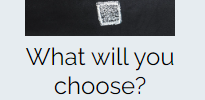
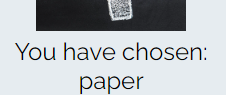
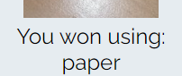
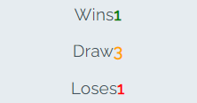
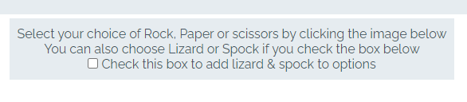

# Rock Paper scissors. Lizard Spock?

Rock Paper scissors. Lizard Spock? 

Its aim for 'Rock Paper scissors. Lizard Spock?' is
 

## Features 

### Existing Features

- __Game Area__

  - Displays images to show the user and computer choices.
  - Cycles through images of rock, paper and scissors to imitate what people say when they play in real life.
  - Images are cycled through with a final question mark image for suspence before showing the choices.
  - Player & computer choices are displayed and an alert tells the if they won, lost or drew.
  - Alert tells them what choices they made and if they lost tells them which choice could of won.
  
- __Game text__
    - Text starts as "What will you choose?" to make the game seem more personable.
    - This text changes when players have selected a choice to indicate they have successfully made a choice.
    It changes to "you have chosen:" and says the choice they made.
    - Text changes at the end of the turn to indicate it is over by telling the player they either won, lost 
    or drew and telling them the choice they had made.

  

- __Score__
    - The wins, loses and draws of the player are tracked & displayed here for players enjoyment
    - Wins, loses and draws are coloured green, red and orange respectively so player can easily see which
    is good, bad and neutral.

- __Instructions__
    - Instructions for how to play are displayed to help users interact with the page.
    - A checkbox is used to add additional choices or lizard and spock. This gives players the choice of 
    playing the simple game or a questionably more difficult version.

- __Controls__
    - Each choices can be selected by clicking images of that option. This is more enjoyable than selecting 
    words.
    - Choices have different coloured, rounded boarders to make them identifiable from each other and to 
    feel more fun.
    - Choices are highlighted on hover to make it easier to know which you are choosing and to identify them
    as buttons to be clicked.
    - Controls disable to stop multiple inputs during turn.
    - Choices for lizard and spock are hidden when not viable to prevent confusion 

### Future Features

- __Resizing__
    - Currently fits on all screen sizes. In future will increase size on bigger screens to fill space

- __2 player__
    - A feature to play against a friend or stranger instead of the computer. online or on the same page.
    Player could also play against themselfs.

------

### Validator Testing 

- HTML
   - No errors were returned when passing through the official [W3C validator](https://validator.w3.org/nu/?doc=https%3A%2F%2Fadd-faun.github.io%2FrpsTest%2F)
- CSS
  - No errors were found when passing through the official [(Jigsaw) validator](https://jigsaw.w3.org/css-validator/validator?uri=https%3A%2F%2Fadd-faun.github.io%2FrpsTest%2F&profile=css3svg&usermedium=all&warning=1&vextwarning=&lang=en)
- JavaScript
    - No errors were found when passing through the official [Jshint validator](https://jshint.com/)
      - The following metrics were returned: 
      - There are 24 functions in this file.
      - Function with the largest signature take 2 arguments, while the median is 0.
      - Largest function has 14 statements in it, while the median is 2.5.
      - The most complex function has a cyclomatic complexity value of 9 while the median is 1.
      - 31 warnings of "is available in ES6 (use 'esversion: 6') or Mozilla JS extensions (use moz)."

### Unfixed Bugs

  - Uncaught (in promise) DOMException: play() failed because the user didn't interact with the document first.
  - Uncaught (in promise) Error: A listener indicated an asynchronous response by returning true, but the message channel closed before a response was received.

------

## Deployment

Rock Paper scissors. Lizard Spock? was deployed using github pages. 

- The site was deployed to GitHub pages. The steps to deploy are as follows: 
  - In the GitHub repository, navigated to the Settings tab 
  - Navigated to the pages section under Code and automation
  - Source chosen was deploy from branch
  - Main branch was chosen and saved, page refreshed with a working link to indicate the successful deployment. 

The live link can be found here - https://add-faun.github.io/rpsTest/

### Content 

- The icons in the header were taken from [Font Awesome](https://fontawesome.com/)

### Media

- The photos used for the choices were taken by me.
- The image used for mystery in game-area were taken from open source site xxxxx

**Anything more?**

Yes! We'd strongly encourage you to look at the source code of the `uptime.sh` file so that you know what it's doing. As future software developers, it will be great practice to see how these shell scripts work.

---

Happy coding!
